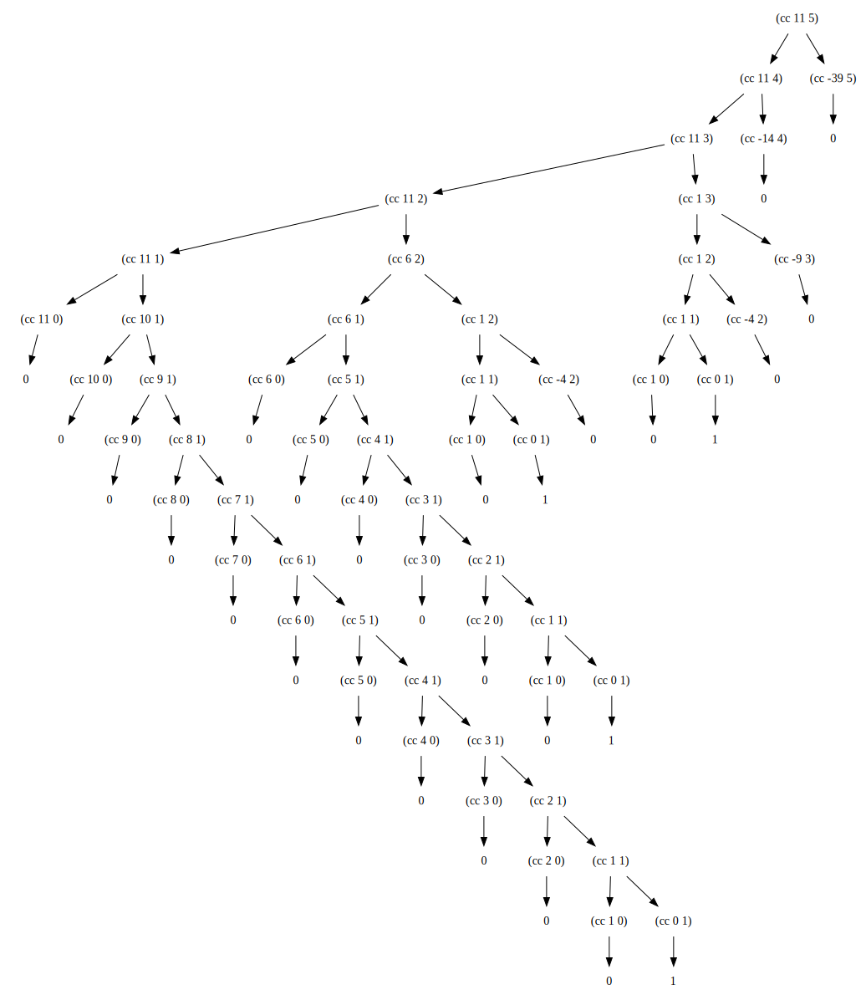

## exercise 1.14

Swap 11 cents for a coin, and the calculation is shown below. As you can see, this tree is very large, and the required space and time for the calculation is exponential growth.

。
