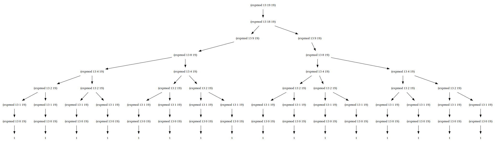
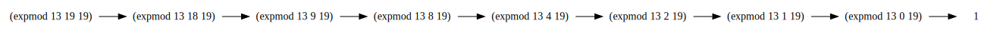

## exercise 1.26

``` Scheme
(define (expmod base exp m)
  (cond ((= exp 0) 1)
        ((even? exp)
         (remainder 
           (* (expmod base (/ exp 2) m)
              (expmod base (/ exp 2) m))
           m))
        (else
          (remainder 
            (* base 
               (expmod base (- exp 1) m))
            m))))
```

In Louis' implementation above, `(expmod base (/ exp 2) m)` occurs twice and is computed twice in the recursive process.So each time I recurse, exp is halved, but I've computed it twice.And then they cancel out, so the computational complexity is  Θ(n).

The original implementation, using `square`， `(expmod base (/ exp 2) m))` will only calculate once.So each time I recurse, exp is halved.So the computational complexity is Θ(logN).

------

Just to visualize the difference.We can use the [Lua 代码](./exercise_1_26_dot.lua)o output the Dot code and convert it to an image, similar to Exercise 1.14.We expand the graph of `(expmod 13 19 19)` 



You can see, it's a tree.The lower the node, such as `(expmod 13 1 19)`, the more times it is counted.

------

And the original implementation, `(expmod 13 19 19)` calculation diagram is very simple and direct.



It's just the leftmost path in the figure above.


