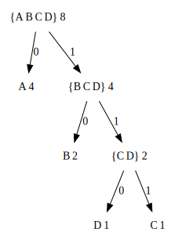

## exercise 2.67

``` Scheme
(define sample-tree
  (make-code-tree (make-leaf 'A 4)
                  (make-code-tree (make-leaf 'B 2)
                                  (make-code-tree (make-leaf 'D 1)
                                                  (make-leaf 'C 1)))))
(define sample-message '(0 1 1 0 0 1 0 1 0 1 1 1 0))
```

The shape of Huffman tree is shown below:



Manual decoding according to the code tree `(0 1 1 0 0 1 0 1 0 1 1 1 0)`。

|surplus                       | prefix      | symbol       | 
|--------------------------|-----------|-----------|
|0 1 1 0 0 1 0 1 0 1 1 1 0 | 0         |  A         |
|1 1 0 0 1 0 1 0 1 1 1 0   | 1 1 0     |  D         |
|0 1 0 1 0 1 1 1 0         | 0         |  A         |
|1 0 1 0 1 1 1 0           | 1 0       |  B         |
|1 0 1 1 1 0               | 1 0       |  B         |
|1 1 1 0                   | 1 1 1     |  C         |
| 0                        | 0         |  A         |

And then  get your final result.

``` Scheme
'(A D A B B C A)
```

Execute the program [Huffman code tree](huffman_tree.scm) and get the same result.


### appendix

The graph was drawn using Graphviz.Draw Huffman Tree Dot code is as follows:

``` Dot
digraph G {
    node [shape=plaintext]
    node_A [label="A 4"]
    node_B [label="B 2"]
    node_D [label="D 1"]
    node_C [label="C 1"]
    node_CD [label="{C D} 2"]
    node_BCD [label="{B C D} 4"]
    node_ABCD [label="{A B C D} 8"]
    
    node_CD -> node_D [label="0"]
    node_CD -> node_C [label="1"]
    
    node_BCD -> node_B [label="0"]
    node_BCD -> node_CD [label="1"]
    
    node_ABCD -> node_A [label="0"]
    node_ABCD -> node_BCD [label="1"]
}
```
