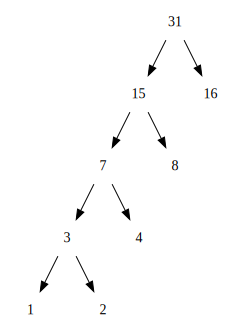
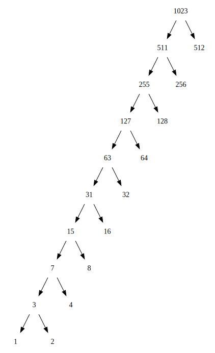

## exercise 2.71

The tree below shows only the frequency, not the symbol.

When n = 5, the figure is as follows

When n = 10, the figure is as follows

The shape of the tree is very regular.For such a tree, the symbol that appears most frequently in the code uses 1 binary bit.The least frequently encoded symbol requires n-1 bits.

------
The tree was drawn using the Graphviz tool. Using [Lua code here](exercise_2_71_dot.lua), change the value of input_N to print the Dot code.
