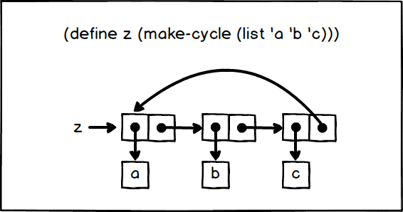

## exercise 3.13

Box pointer:



When we compute '(last-pair z)', the program loops indefinitely.

## code

``` Scheme
#lang sicp

(define (last-pair x)
  (if (null? (cdr x))
      x 
      (last-pair (cdr x))))

(define (make-cycle x)
  (set-cdr! (last-pair x) x)
  x)

;;;;;;;
(define z (make-cycle (list 'a 'b 'c)))
z               ; #0=(a b c . #0#)
; (last-pair z) ; infinite loop
```
