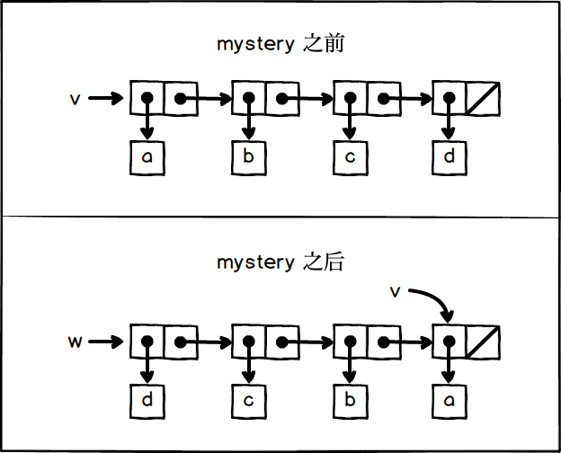

## exercise 3.14
 
What mystery does is flip the list, which is a modified version of the reverse function, modifying the argument x passed in.

v starts with '(a, b, c, d)'.'(mystery v)' is called, returning a flip of v, so w is' (d c b a) '.But modified v, after the call, v is' (a) '.

Box pointer:



### code

``` Scheme
#lang sicp

(define (mystery x)
  (define (loop x y)
    (if (null? x)
        y
        (let ((temp (cdr x)))
          (set-cdr! x y)
          (loop temp x))))
  (loop x '()))

;;;;;;;;;;;;;;;;;;;;;;
(define v (list 'a 'b 'c 'd))
v   ; (a b c d)

(define w (mystery v))
v   ; (a)
w   ; (d c b a)
```
