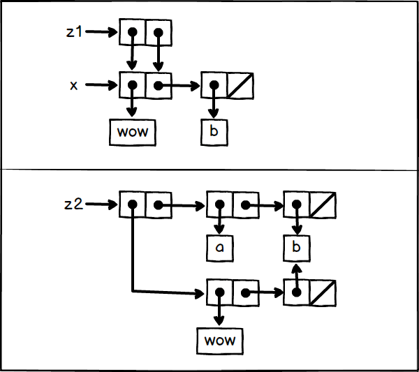

## exercise 3.15
 
Box pointer:



'(car z1)' and '(cdr z1)' both point to the same object x.So when using set-car!Modify 'car z1)', also change '(cdr z1)'.
And '(car z2)' and '(cdr z2)' are two separate objects.Therefore, even if '(car z2)' is modified, '(cdr z2)' remains the same.

### code

``` Scheme
#lang sicp

(define (set-to-wow! x)
  (set-car! (car x) 'wow)
  x)

(define x (list 'a 'b))
(define z1 (cons x x))
(define z2 (cons (list 'a 'b) (list 'a 'b)))

z1                ; ((a b) a b)
(set-to-wow! z1)  ; ((wow b) wow b)

z2                ; ((a b) a b)
(set-to-wow! z2)  ; ((wow b) a b)
```
