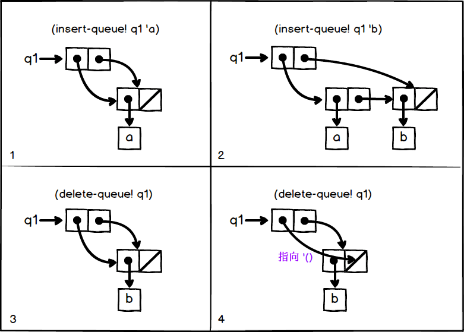

## exercise 3.21

In the queue internal structure, the first pair, (car q) is the front-end pointer and (cdr q) is the back-end pointer.The standard output function, not understanding the queue structure, prints out both the car and cdr sections.And (cdr q)
The box pointer is shown below:



Using Figure 2(top right square) as an example, print q1.q1 is a pair, so it prints (car q1) as (a b) and then prints (cdr q2) as (b).The structure in Figure 2 is printed

```
((a b) b)
```

To print the elements of the list correctly, print-queue only needs to print the car part, which can be implemented as

``` Scheme
(define (print-queue queue)
  (display (car queue))
  (newline))
```

 
Complete code
```Scheme
#lang sicp

(#%provide make-queue insert-queue! delete-queue! empty-queue? front-queue)

(define (front-ptr queue) (car queue))

(define (rear-ptr queue) (cdr queue))

(define (set-front-ptr! queue item) (set-car! queue item))

(define (set-rear-ptr! queue item) (set-cdr! queue item))

(define (empty-queue? queue) (null? (front-ptr queue)))

(define (make-queue) (cons '() '()))

(define (front-queue queue)
  (if (empty-queue? queue)
      (error "FRONT called with an empty queue" queue)
      (car (front-ptr queue))))

(define (insert-queue! queue item)
  (let ((new-pair (cons item '())))
    (cond ((empty-queue? queue)
           (set-front-ptr! queue new-pair)
           (set-rear-ptr! queue new-pair)
           queue)
          (else 
            (set-cdr! (rear-ptr queue) new-pair)
            (set-rear-ptr! queue new-pair)
            queue))))

(define (delete-queue! queue)
  (cond ((empty-queue? queue)
         (error "DELETE! called with an empty queue" queue))
        (else
          (set-front-ptr! queue (cdr (front-ptr queue)))
          queue)))

(define (print-queue queue)
  (display (car queue))
  (newline))

;;;;;;;;;;;;;;;;;;;;;;;;;;;;
(#%require (only racket module*))
(module* main #f
  (define q1 (make-queue))
  
  (insert-queue! q1 'a) ; ((a) a)
  (print-queue q1)      ; (a)
  
  (insert-queue! q1 'b) ; ((a b) b)
  (print-queue q1)      ; (a b)
  
  (delete-queue! q1)    ; ((b) b)
  (print-queue q1)      ; (b)
  
  (delete-queue! q1)    ; (() b)
  (print-queue q1)      ; ()
)
```
