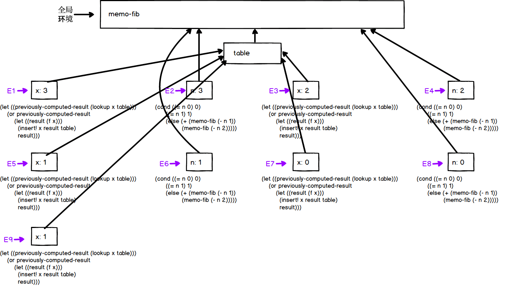

## exercise 3.27

Complete code
``` Scheme
#lang sicp

(define (lookup key table)
  (let ((record (assoc key (cdr table))))
    (if record
        (cdr record)
        false)))

(define (assoc key records)
  (cond ((null? records) false)
        ((equal? key (caar records)) (car records))
        (else (assoc key (cdr records)))))

(define (insert! key value table)
  (let ((record (assoc key (cdr table))))
    (if record
        (set-cdr! record value)
        (set-cdr! table 
                  (cons (cons key value) (cdr table))))))

(define (make-table)
  (list '*table*))
;;;;;;;;;;;;;;;;;;;;;;;;;;;;;;;;;;;;;
(define (memoize f)
  (let ((table (make-table)))
    (lambda (x)
      ;(display "memoize ")
      ;(display x)
      ;(newline)
      (let ((previously-computed-result (lookup x table)))
        (or previously-computed-result
            (let ((result (f x)))
             (insert! x result table)
              result))))))

(define memo-fib
  (memoize (lambda (n)
             (display "memo-fib ")
             (display n)
             (newline)
             (cond ((= n 0) 0)
                   ((= n 1) 1)
                   (else (+ (memo-fib (- n 1))
                            (memo-fib (- n 2))))))))

(define (fib n)
  (display "call fib ")
  (display n)
  (newline)
  (cond ((= n 0) 0)
        ((= n 1) 1)
        (else (+ (fib (- n 1))
                 (fib (- n 2))))))

(define memo-fib-2 (memoize fib))
;(set! fib memo-fib-2)

;;;;;;;;;;;;;;;;;;;;;;;
(memo-fib 5)
(memo-fib-2 5)

```

### Calculation diagram

`(memo-fib 3)` Computed graph：



### analysis mem-fib

For each n, '(mim-fib n)' is calculated only once, and the next time the result is returned from the table.

For example, the result of '(mim-fib 1)' calculated in E5 is added to the table.So E9 calculates (mim-fib 1) again, with key = 1 already in the table, and can return the result without having to repeat the calculation.

So n goes down linearly, it doesn't bifurcate into a tree like a normal recursive fib.In other words, the mem-fib calculation steps are proportional to n.

For a better view, you can add some print information to the mim-FIB：

``` Scheme
(define memo-fib
  (memoize (lambda (n)
             (display "call memo-fib ")
             (display n)
             (newline)
             (cond ((= n 0) 0)
                   ((= n 1) 1)
                   (else (+ (memo-fib (- n 1))
                            (memo-fib (- n 2))))))))

(memo-fib 5)
```
output

```
memo-fib 5
memo-fib 4
memo-fib 3
memo-fib 2
memo-fib 1
memo-fib 0
5
```

And we see that n does go down linearly.

### analysis (memoize fib)

If memoize fib is defined as' (memoize fib) ', it does not achieve the desired effect.The memo-fib calls the fib, but the fib recursively calls the original fib. The fib does not have a table to record the previous calculation.

Add some printed information to the fib for a clearer view.

``` Scheme
(define (fib n)
  (display "call fib ")
  (display n)
  (newline)
  (cond ((= n 0) 0)
        ((= n 1) 1)
        (else (+ (fib (- n 1))
                 (fib (- n 2))))))

(define memo-fib-2 (memoize fib))
(memo-fib-2 5)
```

output

```
call fib 5
call fib 4
call fib 3
call fib 2
call fib 1
call fib 0
call fib 1
call fib 2
call fib 1
call fib 0
call fib 3
call fib 2
call fib 1
call fib 0
call fib 1
5
```

It can be seen that '(fib 3)', '(fib 2)', '(fib 1)', and so on are called repeatedly.

If you must write '(memoize fib)', you can use set!Modify fib in the global environment to a memorized version, such as:

``` Scheme
(define memo-fib-2 (memoize fib))
(set! fib memo-fib-2)
(memo-fib-2 5)
```

This can avoid double counting, but it also changes the original meaning of fib, which is potentially dangerous.The output is:

```
call fib 5
call fib 4
call fib 3
call fib 2
call fib 1
call fib 0
5
```
