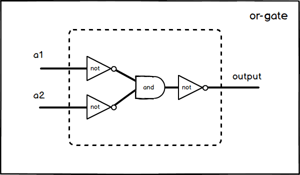

## exercise 3.289

### formula

According to De Morgan's law

``` C
~(a || b) = (~a) && (~b)
```

so

``` C
a || b = ~~(a || b) = ~((~a) && (~b))
```

The above is the notation of C language.

* ~ means inverse (not)
* ampersand is logic and (and)
* | | is logical and (or)

### figure

According to the above formula, or gate can be expressed as



### delay

It can be seen clearly from the figure above that a1 signal reaches output, and through the inverter, and-gate and inverter, the delay from signal a1 to output is

```
2 * inverter-delay + and-gate-delay
```

Similarly, a2 has the same delay to output as a1.So the entire or-gate delay is

```
2 * inverter-delay + and-gate-delay
```

### code

``` Scheme
(define (or-gate a1 a2 output)
  (let ((b (make-wire)) 
        (c (make-wire))
        (d (make-wire))
        )
    (inverter a1 b)
    (inverter a2 c)
    (and-gate b c d)
    (inverter d output)
    'ok))
```


### complete code
``` Scheme
#lang sicp

(#%require "digital_circuit.scm")

(define (or-gate a1 a2 output)
  (let ((b (make-wire)) 
        (c (make-wire))
        (d (make-wire))
        )
    (inverter a1 b)
    (inverter a2 c)
    (and-gate b c d)
    (inverter d output)
    'ok))

;;;;;;;;;;;;;;;;;;;;
(#%require (only racket module*))
(module* main #f
  (define a1 (make-wire))
  (define a2 (make-wire))
  (define output (make-wire))
  (probe 'output output)
  
  (or-gate a1 a2 output)

  (set-signal! a1 1)
  (set-signal! a2 1)
  (propagate) ; output 7  New-value = 1
  
  (set-signal! a1 0)
  (set-signal! a2 0)
  (propagate) ; output 14  New-value = 0
  
  (set-signal! a1 1)
  (set-signal! a2 0)
  (propagate) ; output 21  New-value = 1
)

;Judging from the output signal, the or-gate connection is correct.And when a1 and a2 change
;ouput changes time points 7, 14, 21, and its delay is judged to be 7.
;Definition in digital_circuit.scm
;(define inverter-delay 2)
;(define and-gate-delay 3)
;Can confirm our analysis, or gate delay is 2 * inverter-delay + and-gate-delay = 7


```
