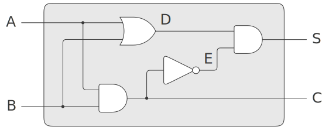

## exercise 3.30

### code

``` Scheme
(define (ripple-carry-adder A B S c-out)
  (define (helper A B S c-in c-out)
    (if (null? (cdr A))
        (full-adder (car A) (car B) c-in (car S) c-out)
        (let ((wire (make-wire)))
          (helper (cdr A) (cdr B) (cdr S) c-in wire)
          (full-adder (car A) (car B) wire (car S) c-out))))
  
  (let ((c-in (make-wire)))
    (set-signal! c-in 0)
    (helper A B S c-in c-out)
    'ok))
```

### Delay analysis

In the cascade carry adder circuit diagram, signals A and B are set directly from the outside without delay.N-bit adder, made up of n full adders in series, the c-in of one full adder is the c-out of another full adder.The delay is mainly caused by c.

To analyze the delay of a cascade carry adder, first analyze the delay of the full adder.The full adder is composed of half adder, and the delay of half adder must be analyzed.

### Half adder



The above figure is the connection diagram of half adder. Signals A and B to S pass through OR-Gate and AND-gate, or through AND-gate, inverter and Or-Gate.The delay of the two is respectively

``` CS
delay-1 = or-gate-delay + and-gate-delay
delay-2 = and-gate-delay + inverter-delay + and-gate-delay
```

So the maximum delay of S is

``` C
half-adder-delay-S = max(or-gate-delay, and-gate-delay + inverter-delay) 
                    + and-gate-delay
```
When the signal reaches C, it only goes through and-gate, so the delay of C is

```
half-adder-delay-C = and-gate-delay
```

### Full adder


To analyze the maximum latency of C-out, we look for the connection path that generates the maximum latency.The maximum delay path is, through the semi-adder, out of the semi-adder S, through the semi-adder, out of the semi-adder C, and through an or-gate.

So the delay of full adder C-out is
```
full-adder-delay-C = half-adder-delay-S + half-adder-delay-C + or-gate-delay
                   = max(or-gate-delay, and-gate-delay + inverter-delay) 
                     + 2 * and-gate-delay + or-gate-delay
```

Similarly, the Sum delay of the full adder is

```
full-adder-delay-Sum = half-adder-delay-S + half-adder-delay-S
                     = 2 * max(or-gate-delay, and-gate-delay + inverter-delay) 
                       + 2 * and-gate-delay
```

obviously

```
full-adder-delay-C < full-adder-delay-Sum < 2 * full-adder-delay-C
```

### Cascade carry adder

The n bit adder is made up of n full adders c in series.The C series delay of the first n-1 full adder is

```
(n - 1) * full-adder-delay-C
```

The final full adder, the Sum exit also relies on the previous C carry, and Sum has a larger delay.

So the maximum delay of the entire carry adder is

```
delay = (n - 1) * full-adder-delay-C + full-adder-delay-Sum
      = (n + 1) * max(or-gate-delay, and-gate-delay + inverter-delay) 
        + 2 * n * and-gate-delay + (n - 1) * or-gate-delay  
```

### verification

in digital_circuit.scm, The simulator defines the delay values for each gate.

``` Scheme
(define inverter-delay 2)
(define and-gate-delay 3)
(define or-gate-delay 5)
```

According to the above analysis, the maximum delay of the 4-bit adder should be

``` C
(n + 1) * 5 + 2 * n * 3 + (n - 1) * 5 = 64
```

In the test code, set (A B) first to '((1 1 1 1) (0 0 0 0))' and then to '((1 1 1 1) (0 0 0 1))', forcing the highest bit and c-out to change.

``` Scheme
(run-simulate '(
                ((1 1 1 1) (0 0 0 0))
                ((1 1 1 1) (0 0 0 1))
                ((1 1 1 1) (0 0 0 0))
                ))
```    

The printout is

```
==========
time: 8
a: (1 1 1 1)
b: (0 0 0 0)
s: (1 1 1 1)
c-out: 0
==========
time: 72
a: (1 1 1 1)
b: (0 0 0 1)
s: (0 0 0 0)
c-out: 1
==========
time: 136
a: (1 1 1 1)
b: (0 0 0 0)
s: (1 1 1 1)
c-out: 0
```

Two time points, 72 minus 8 is 136 minus 72 is 64.The delay of 4 - bit adder is verified.

Similarly, we can verify that the delay of the 8-bit adder is

``` C
(n + 1) * 5 + 2 * n * 3 + (n - 1) * 5 = 128
```


###Complete test code
'''Scheme
#lang sicp

(#%require "digital_circuit.scm")

(define (ripple-carry-adder A B S c-out)
  (define (helper A B S c-in c-out)
    (if (null? (cdr A))
        (full-adder (car A) (car B) c-in (car S) c-out)
        (let ((wire (make-wire)))
          (helper (cdr A) (cdr B) (cdr S) c-in wire)
          (full-adder (car A) (car B) wire (car S) c-out))))
  
  (let ((c-in (make-wire)))
    (set-signal! c-in 0)
    (helper A B S c-in c-out)
    'ok))

;;;;;;;;;;;;;;;;;;;;;;;;;
(define (make-wires n)
  (if (= n 0)
      '()
      (cons (make-wire) (make-wires (- n 1)))))

(define (set-wire-signals! wires values)
  (cond ((not (null? wires))
         (set-signal! (car wires) (car values))
         (set-wire-signals! (cdr wires) (cdr values)))))

(define (get-wire-signals wires)
  (if (null? wires)
      '()
      (append (list (get-signal (car wires))) 
              (get-wire-signals (cdr wires)))))

(define A (make-wires 4))
(define B (make-wires 4))
(define S (make-wires 4))
(define c-out (make-wire))
(ripple-carry-adder A B S c-out)

(define (print-info tag b)
  (display tag)
  (display b)
  (newline))

(define (run-simulate AB-values)
  (cond ((not (null? AB-values))
         (set-wire-signals! A (car (car AB-values)))
         (set-wire-signals! B (cadr (car AB-values)))
         (propagate)
         (print-info "" "==========")
         (print-info "time: " (get-agenda-current-time))
         (print-info "a: " (get-wire-signals A))
         (print-info "b: " (get-wire-signals B))
         (print-info "s: " (get-wire-signals S))
         (print-info "c-out: " (get-signal c-out))
         (run-simulate (cdr AB-values)))))

(run-simulate '(
                ((0 0 0 0) (0 0 0 0))
                ((0 1 1 1) (0 1 1 1))
                ((1 1 1 1) (0 0 0 0))
                ((1 1 1 1) (0 0 0 1))
                ((1 1 1 1) (1 1 1 1))
                ))

;(run-simulate '(
;                ((1 1 1 1) (0 0 0 0))
;                ((1 1 1 1) (0 0 0 1))
;                ((1 1 1 1) (0 0 0 0))
;                ))
'''
