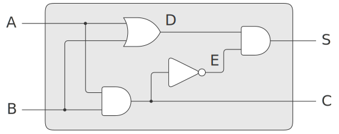

## exercise 3.31



According to the connection of the half adder, the correct S should be 1 when A = 1 and B = 0.

Add the following test code

``` Scheme
(define input-a (make-wire))
(define input-b (make-wire))
(define sum (make-wire))
(define carry (make-wire))
(half-adder input-a input-b sum carry)

(set-signal! input-a 1)
(propagate)

(get-signal sum)
```

Use the original accept-action-procedure!'defined in the above test code.'(get-signal sum)' correctly returns 1.

But if you change it to

```
(define (accept-action-procedure! proc)
  (set! action-procedures (cons proc action-procedures)))
```

In the above test code, the error '(get-signal sum)' returns 0.

## Reason

accept-action-procedure! It's add-action!Triggered.add-action is called when the line is connected to the or-gate, and gate, inverter basic components!To trigger the accept-action-procedure!.

The original accept-action-procedure!In the implementation, once (proc) is called, after-delay is called to initialize the value of the line after a delay of some time.In this way, when the basic components are connected, the signal is transmitted, and the entire circuit is automatically initialized.

If accept-action-procedure!Without calling (proc), the line will not be properly initialized.

So in half adder, when A = 1 and B = 0, the first and-gate output after the invocation of propagate is still 0, which will not trigger the inverter output change.The E line is still incorrectly stuck at zero with no good initial value.But actually the value of line E should be 1.
