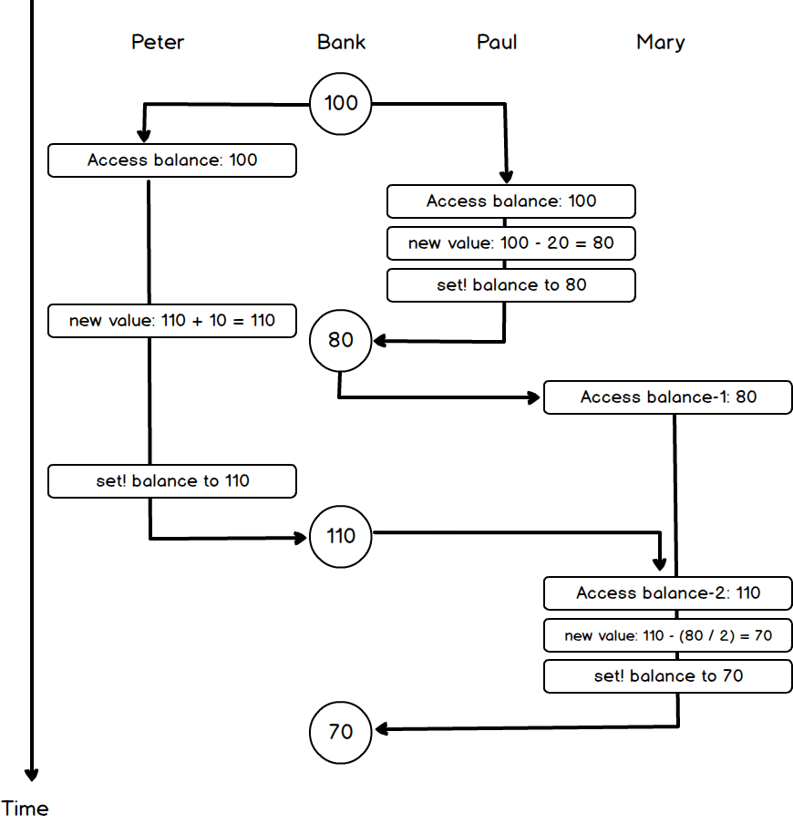

## exercise 3.38

### a)

The Peter, Paul, and Mary processes run in a certain order, and there are six kinds of them.For example, the order '(Peter Paul Mary)' is equivalent to executing the following code:

``` Scheme
#lang racket

(define balance 100)

(set! balance (+ balance 10))             ; 'Peter
(set! balance (- balance 20))             ; 'Paul
(set! balance (- balance (/ balance 2)))  ; 'Mary

(display balance)
```

The final result of balance is 45.

But to avoid manually reordering the code, you can generate '(list 'Peter 'Paul 'Mary)' for each permutation, traversing each order.

The output is:

```
(Peter Paul Mary): 45
(Peter Mary Paul): 35
(Paul Peter Mary): 45
(Paul Mary Peter): 50
(Mary Peter Paul): 40
(Mary Paul Peter): 40
```

Depending on the timing, the possible values of balance are 45, 35, 50, and 40.

### b)

Suppose you allow each process to interleave.Each process is divided into three steps:

1. Get balance.
2. Calculate the new value.
3. Set balance.

Step 3 can be interrupted at any time by other processes.To get the full result, we need to traverse every possible order.

Observe that step 2 (calculating the new value) is per-process independent, and that the order does not affect the final result.So to simplify the calculation, we can simplify it to two steps.

1. Get balance.
2. Calculate the new value and set balance.

Notice one detail. Mary's process is

``` Scheme
(set! balance (- balance (/ balance 2))
```

Mary needs to get balance twice, and each time it can be interrupted.

So we generate

`(list 'Peter-Get 'Peter-Set 'Paul-Get 'Paul-Set 'Mary-Get-1 'Mary-Get-2 'Mary-Set)`

The 7 permutations have a total of 5040 scenarios.When Mary needs to obtain balance twice, it is divided into mary-get-1 and Mary-get-2.

In each process, get must be executed before set.So there's the following mandatory order

* Peter-Get、Peter-Set
* Paul-Get、Paul-Set
* Mary-Get-1、Mary-Get-2、Mary-Set

In the case of the Mary process, the permutation of 3 items is 3!.But under the mandatory order, there's only one permutation left.The forced order is then filtered out, and the possible case is' 5040 / (2!* 2!* 3!)= 210 'kinds.

Generate all possible permutations, run them one by one, and get every possible result.

The output is as follows (the output is too long to list them all):

```
(Peter-Get Peter-Set Paul-Get Paul-Set Mary-Get-1 Mary-Get-2 Mary-Set): 45
(Peter-Get Peter-Set Paul-Get Mary-Get-1 Paul-Set Mary-Get-2 Mary-Set): 35
(Peter-Get Peter-Set Paul-Get Mary-Get-1 Mary-Get-2 Paul-Set Mary-Set): 55
(Peter-Get Peter-Set Paul-Get Mary-Get-1 Mary-Get-2 Mary-Set Paul-Set): 90
(Peter-Get Peter-Set Mary-Get-1 Paul-Get Paul-Set Mary-Get-2 Mary-Set): 35
(Peter-Get Peter-Set Mary-Get-1 Paul-Get Mary-Get-2 Paul-Set Mary-Set): 55
(Peter-Get Peter-Set Mary-Get-1 Paul-Get Mary-Get-2 Mary-Set Paul-Set): 90
....
(Mary-Get-1 Mary-Get-2 Mary-Set Peter-Get Peter-Set Paul-Get Paul-Set): 40
(Mary-Get-1 Mary-Get-2 Mary-Set Peter-Get Paul-Get Peter-Set Paul-Set): 30
(Mary-Get-1 Mary-Get-2 Mary-Set Peter-Get Paul-Get Paul-Set Peter-Set): 60
(Mary-Get-1 Mary-Get-2 Mary-Set Paul-Get Peter-Get Peter-Set Paul-Set): 30
(Mary-Get-1 Mary-Get-2 Mary-Set Paul-Get Peter-Get Paul-Set Peter-Set): 60
(Mary-Get-1 Mary-Get-2 Mary-Set Paul-Get Paul-Set Peter-Get Peter-Set): 40
'(50 60 30 110 70 80 25 40 90 55 35 45)
```

Depending on the order, the possible value of final balance is' (50 60 30 110 70 80 25 40 90 55 35 45) '.

### draw

I can't draw every case. I just draw

```
(Peter-Get Paul-Get Paul-Set Mary-Get-1 Peter-Set Mary-Get-2 Mary-Set): 70
```

A sequence diagram of this situation.




### Problem a complete program

#lang racket
```Scheme
(require "ch3support.scm")

(define (run orders)
  (let ((balance 100))
    (define (process x)
      (cond ((eq? x 'Peter)
             (set! balance (+ balance 10)))
            ((eq? x 'Paul)
             (set! balance (- balance 20)))
            ((eq? x 'Mary)
             (set! balance (- balance (/ balance 2))))))
    (for-each process orders)
    (display orders)
    (display ": ")
    (display balance)
    (newline)))

(define orders (permutations (list 'Peter 'Paul 'Mary)))
(for-each run orders)
```

### Problem b Complete program

```Scheme
#lang racket

(require "ch3support.scm")

(define (element-of-set? x set)
  (cond ((null? set) false)
        ((equal? x (car set)) true)
        (else (element-of-set? x (cdr set)))))

(define (adjoin-set x set)
  (if (element-of-set? x set)
      set
      (cons x set)))

;;;;;;;;;;;;;;;;;;;;;;;;;;;;;;;;
(define all-balance-values '())

(define (run orders)
  (let ((balance 100)
        (peter-balance 0)
        (paul-balance 0)
        (mary-balance-1 0)
        (mary-balance-2 0)
        )
    (define (process x)
      (cond ((eq? x 'Peter-Get)
             (set! peter-balance balance))
            ((eq? x 'Peter-Set)
             (set! balance (+ peter-balance 10)))
            ((eq? x 'Paul-Get)
             (set! paul-balance balance))
            ((eq? x 'Paul-Set)
             (set! balance (- paul-balance 20)))
            ((eq? x 'Mary-Get-1)
             (set! mary-balance-1 balance))
            ((eq? x 'Mary-Get-2)
             (set! mary-balance-2 balance))
            ((eq? x 'Mary-Set)
             (set! balance (- mary-balance-2 (/ mary-balance-1 2))))))
    (for-each process orders)
    
    (set! all-balance-values(adjoin-set balance all-balance-values))
    (display orders)
    (display ": ")
    (display balance)
    (newline)))

;Used to determine whether a precedes b in the list.
;When a is in front of b, you must search for a first, then search for b
(define (right-order? order a b)
  (and (memq a order)
       (memq b (memq a order))))

(define (gen-orders)
  (let* ((lst (list 'Peter-Get 'Peter-Set 'Paul-Get 'Paul-Set 'Mary-Get-1 'Mary-Get-2 'Mary-Set))
         (orders (permutations lst)))
    (filter (lambda (x)
              (and (right-order? x 'Peter-Get 'Peter-Set)
                   (right-order? x 'Paul-Get 'Paul-Set)
                   (right-order? x 'Mary-Get-1 'Mary-Get-2)
                   (right-order? x 'Mary-Get-2 'Mary-Set)))
            orders)))

(define orders (gen-orders))
(for-each run orders)
all-balance-values
```

