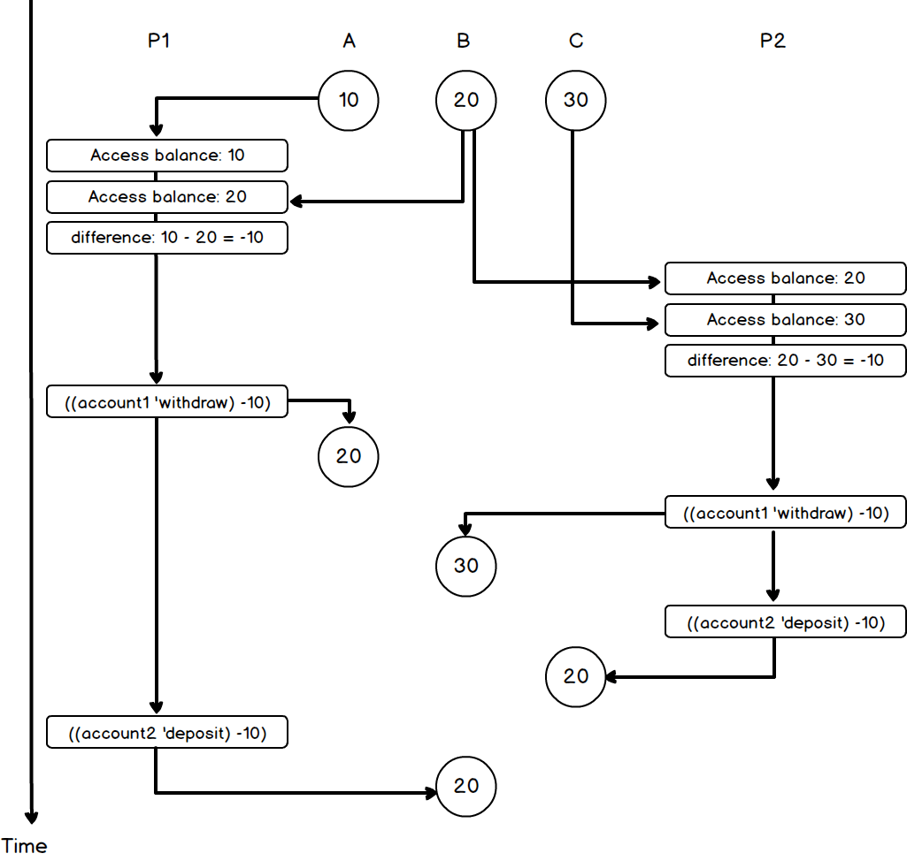
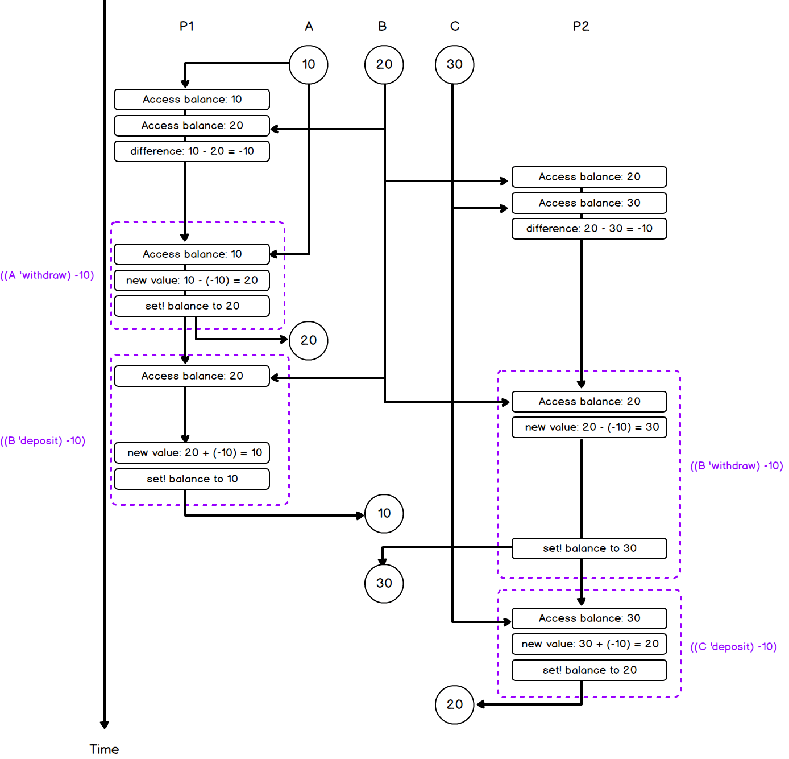

## P215 - [练习 3.43]

### a)

The initial balance of the three accounts is a permutation of (10, 20, 30).Consider any swap operation. If the process is executed sequentially, the swap simply changes the order of the two balances and does not produce a new balance value.So the balance before the exchange is a permutation of (10, 20, 30), and the balance after the exchange must also be a permutation of (10, 20, 30).

The balance is a permutation of (10, 20, 30), and this property doesn't change under the swap operation.Therefore, the initial balance is a permutation of (10, 20, 30), which does not change after any exchange. In the final state, the balance must also be a permutation of (10, 20, 30).

### b)

The implementation of the exchange version at the beginning of this section can be divided into several separate parts

```
1. (account1 'balance)
2. (account2 'balance)
3. Calculate difference
4. ((account1 'withdraw) difference)
5. ((account2 'deposit) difference)
```

Each part is indivisible on its own, but can be interrupted by other processes.We do it in parallel

```
P1: (exchange A B)
P2: (exchange B C)
```

It is possible to produce the following sequence

```
P1: (A 'balance) = 10
P1: (B 'balance) = 20
P1: calculate difference = -10
P2: (B 'balance) = 20
P2: (C 'balance) = 30
P2: calculate difference = -10
P1: ((A 'withdraw) -10) ; A has a balance of 20
P2: ((B 'withdraw) -10) ; B has a balance of 30
P2: ((C 'deposit) -10)  ; C has a balance of 20
P1: ((B 'deposit) -10)  ; B has a balance of 20
``` 

So the final balance of all three accounts is 20.Notice the comment below P214, which extends withdraw and deposit to accept negative numbers.The timing diagram is as follows:



### c)

As previously analyzed, exchange at the beginning of this section can be broken down into five steps.

```
1. (account1 'balance)
2. (account2 'balance)
3. calculate difference
4. ((account1 'withdraw) difference)
5. ((account2 'deposit) difference)
```

The first 3 steps do not affect the total balance.However, steps 4 and 5 above only operate a single account, and the single account is protected by serial. Steps 4 and 5 can be regarded as an inseparable whole.So in between steps 4 and 5, other actions are inserted, whether or not they are interrupted.As long as the exchange can be finally executed, withdraw and deposit cancel each other and the total account balance remains unchanged.

Therefore, a single exchange can guarantee the total balance remains unchanged, and any exchange can also guarantee the total balance remains unchanged.

### d)

The exchange at the beginning of this section keeps the total balance the same.Step 4 and Step 5 are protected by serial, and are themselves an uninterruptible whole.If the account is not serialized, steps 4 and 5 May be decomposed again.exchange then becomes.

```
1. (account1 'balance)
2. (account2 'balance)
3. calculate difference
4. account1: get balance
5. account1: calcualte new-value (blance - amount)
6. account1: set balance
7. account2: get balance
8. account2: calculate new-value (blance + amount)
9. account2: set balance
```

Numbers 4-7 are the decomposition of the original '(account1 'withdraw) difference)' and 7-9 are the decomposition of the original '((account2 'deposit) difference)'.

This is parallel execution

```
P1: (exchange A B)
P2: (exchange B C)
```

Consider the following sequence

```
P1: (A 'balance) = 10
P1: (B 'balance) = 20
P1: calculate difference = -10
P2: (B 'balance) = 20
P2: (C 'balance) = 30
P2: calculate difference = -10
P1: Account A - Obtain balance = 10
P1: Account A - Calculate new-value (bill-amount) = 20
P1: Account A - Set balance to 20
P1: Account B - Obtain balance = 20
P2: Account B - Obtain balance = 20
P2: B account - Calculate new-value (blan-amount) = 30
P1: Account B - Calculate new-value (blance + amount) = 10
P1: account B - Set balance to 10
P2: account B - Set balance to 30
P2: Account C - Obtain 30
P2: Account C - Calculate new-value (blance + amount) = 20
P2: account C - Set balance to 20
```

The final balance of account A, B and C is (20, 30, 20).The total balance has also changed.The timing diagram is as follows:



