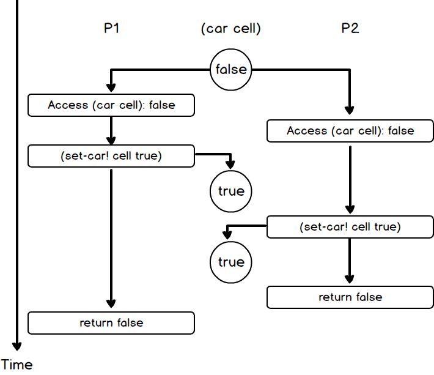

## exercise 3.46

If test-and-set! is not atomic, P1 and P2 execute (mutex 'acquire) in parallel, triggering test-and-set! function.

The following sequence may appear:

Both P1 and P2 return false.So '(mutex 'acquire)' would both return, and P1 and P2 would acquire mutex at the same time, which is obviously wrong.
Atomic operation test-and-set!, it is impossible for both parallel computations to return false.
