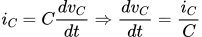
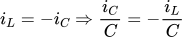
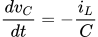
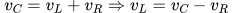
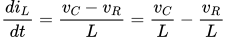
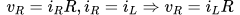
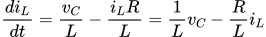

## exercise 3.80

### a)

<!-- $i_{C}=C\frac{dv_{C}}{dt}\Rightarrow\frac{dv_{C}}{dt}=\frac{i_{C}}{C}$ -->



<!-- $i_{L}=-i_{C}\Rightarrow\frac{i_{C}}{C}=-\frac{i_{L}}{C}$ -->



Combined with the above two formulas, there is

<!-- $\frac{dv_{C}}{dt}=-\frac{i_{L}}{C}$ -->



### b)

<!-- $v_{L}=L\frac{di_{L}}{dt}\Rightarrow\frac{di_{L}}{dt}=\frac{v_{L}}{L}$ -->


<!-- $v_{C}=v_{L}+v_{R}\Rightarrow v_{L}=v_{C}-v_{R}$ -->



Combined with the above two formulas, there is

<!-- $\frac{di_{L}}{dt}=\frac{v_{C}-v_{R}}{L}=\frac{v_{C}}{L}-\frac{v_{R}}{L}$ -->



In addition

<!-- $v_{R}=i_{R}R, i_{R}=i_{L}\Rightarrow v_{R}=i_{L}R$ -->



Combine the above two formulas to get the result

<!-- $\frac{di_{L}}{dt}=\frac{v_{C}}{L}-\frac{i_{L}R}{L}=\frac{1}{L}v_{C}-\frac{R}{L}i_{L}$ -->



### Code

According to formula a) and b), the RLC code is

``` Scheme
(define (RLC R L C dt)
  (lambda (vc0 iL0)
    (define vc (integral (delay (scale-stream iL (- (/ 1.0 C)))) vc0 dt))
    (define iL (integral (delay diL) iL0 dt))
    (define diL (add-streams (scale-stream vc (/ 1.0 L))
                             (scale-stream iL (- (/ R L)))))
    (stream-map cons vc iL)))
```


### Complete code
```Scheme
#lang racket

(require "stream.scm")
(require "infinite_stream.scm")

(define (integral delayed-integrand initial-value dt)
  (define int
    (cons-stream initial-value
                 (let ((integrand (force delayed-integrand)))
                   (add-streams (scale-stream integrand dt)
                                int))))
  int)

(define (RLC R L C dt)
  (lambda (vc0 iL0)
    (define vc (integral (delay (scale-stream iL (- (/ 1.0 C)))) vc0 dt))
    (define iL (integral (delay diL) iL0 dt))
    (define diL (add-streams (scale-stream vc (/ 1.0 L))
                             (scale-stream iL (- (/ R L)))))
    (stream-map cons vc iL)))

;;;;;;;;;;;;;;;;;;;
(define RLC1 (RLC 1 1 0.2 0.1))
(display-stream-n (RLC1 10 0) 20)
```
