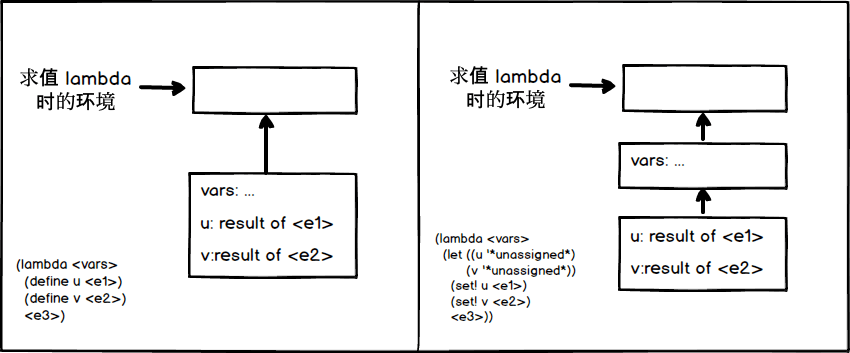

## exercise 4.17

### a)

Before and after the transformation of the code, execute  `<e3>` and the environment diagram is as follows:



The converted code is

``` Scheme
(lambda <vars>
  (let ((u '*unassigned*)
        (v '*unassigned*))
    (set! u <e1>)
    (set! v <e2>)
    <e3>))
```

See [exercise 4.6](./4.6.md)that the let syntax is just a derivative of the lambda.Each let statement corresponds to a lambda.Implementing lambda results in one more environment framework.So the transformed code will have one more frame than before.

### b)

See the figure above, the transformed code, execute `<e3>`, when looking for the value of vars.If you can't find vars in the innermost framework, it automatically looks for the outermost environment framework.That's when you find it.And the vars value is executed the same as the code before the transformation.

Thus the transformation of the code, even if more than a framework, will not affect the execution of the program.
### c)

Instead of generating more frames, `scan-out-defines` puts all define statements first.For example

``` Scheme
(
 (define a 1)
 (+ a b)
 (define b 1)
)
```

Convert to

``` Scheme
(
 (define a 1)
 (define b 1)
 (+ a b)
)
```

Its implementation is

``` Scheme
(define (filter predicate sequence)
  (if (null? sequence)
      '()
      (if (predicate (car sequence))
          (cons (car sequence) (filter predicate (cdr sequence)))
          (filter predicate (cdr sequence)))))

(define (scan-out-defines body)
  (define (body-defines body)
    (filter definition? body))
  (define (body-not-defines body)
    (filter (lambda (exp) (not (definition? exp))) body))
  (let ((defines (body-defines body)))
    (if (null? defines)
        body
        (append (body-defines body) (body-not-defines body)))))
```

Compared to the implementation of `scan-out-defines` in  [exercise 4.16](./4.16.md), the behavior is different.The implementation in Exercise 4.16 preserves the order of statements ,if executed

``` Scheme
(define (f)
  (define a 1)
  (+ a b)
  (define b 1))
(f)
```

Because b has not yet been assigned, the error `variable is unassigned b`is generated.

The implementation here, in order to omit a frame, moves the `define` statement to the front.The above test code executes successfully, with a result of 2.

I think the implementation in [exercise 4.16](./4.16.md)would be more reasonable to preserve the statement order.Adjusting the order of statements can result in some unexpected behavior.
