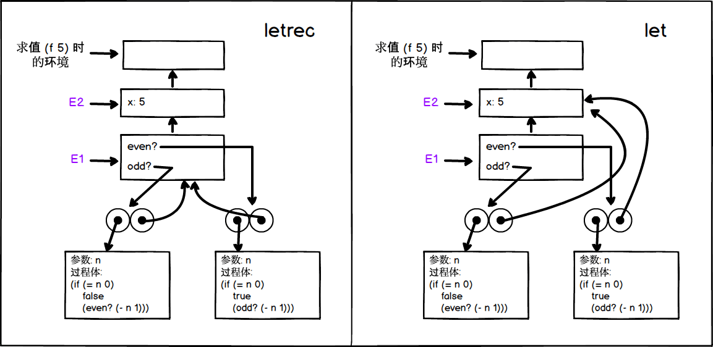

## exercise 4.20

### a)

We implement letrec as a derivative expression of let.The following code

``` Scheme
(letrec ((even?
           (lambda (n)
             (if (= n 0)
                 true
                 (odd? (- n 1)))))
         (odd?
           (lambda (n)
             (if (= n 0)
                 false
                 (even? (- n 1))))))
  <rest of body of f>)
```

Will be converted to

``` Scheme
(let ((even? '*unassigned*) 
      (odd? '*unassigned*)) 
  (set! even? (lambda (n) 
                (if (= n 0) 
                    true 
                    (odd? (- n 1))))) 
  (set! odd? (lambda (n) 
               (if (= n 0) 
                   false 
                   (even? (- n 1))))) 
  <rest of body of f>)
```

Modify the test based on [mceval.scm](./mceval.scm) . `eval` adds judgment

``` Scheme
((letrec? exp) (eval (letrec->let exp) env))
```
 
`letrec` syntax is implemented as

``` Scheme
(define (letrec? exp) (tagged-list? exp 'letrec))

(define (letrec->let exp)
  (define (letrec-body exp) (cddr exp))
  (define (name-unassigned exp) 
    (map (lambda (pair) (list (car pair) ''*unassigned*)) (cadr exp)))
  (define (name-sets exp)
    (map (lambda (pair) (list 'set! (car pair) (cadr pair))) (cadr exp)))
  (append (list 'let (name-unassigned exp))
          (append (name-sets exp) (letrec-body exp))))
```

### b)

When executing `(f 5)`, the environment diagram using letrec and let, respectively, is shown below.



The difference lies in the innermost environment that `even?` and `odd?` are associated with.

With letrec, as shown on the left, the environment points to E1, so executing the statement in the body of the procedure smoothly finds even? and odd? definition。

When we use let, as shown in the figure on the right, the environment points to E2, and when we execute the statement, we cannot find even? and odd? definition，thus making an error.


