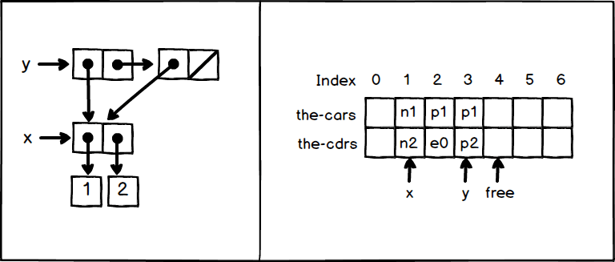

## exercise 5.20

``` Scheme
(define x (cons 1 2))
(define y (list x x))
```

The box pointer diagram, and the memory vector diagram are shown below



y is equal to

``` Scheme
(cons x (cons x '()))
```

Here we assume that we are assigning `(const x '())` first from right to left. So y is at Index = 3.

If the allocation order is from left to right, the specific data stored in Index 2 and 3 will be adjusted, so that y points to Index = 2.
