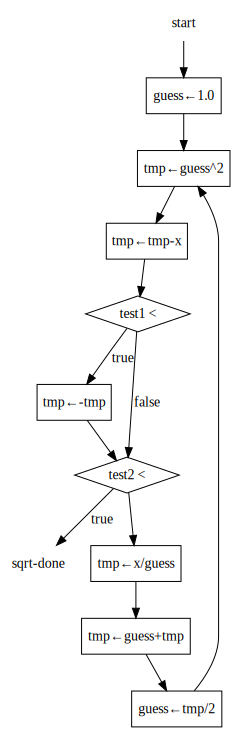

## exercise 5.3

### Stepwise expansion

sqrt machine, assuming `good-enough?` and `improve` are basic operations.

``` Scheme
(controller
  (assign guess (const 1.0))
test-guess  
  (test (op good-enough?) (reg guess))
  (branch (label sqrt-done))
  (assign guess (op improve) (reg guess))
  (goto (label test-guess))
sqrt-done)
```

`good-enough?` machine, assuming that `square` and `abs` are basic operations.

``` Scheme
(controller
  (assign tmp (op square) (reg guess))
  (assign tmp (op -) (reg tmp) (reg x))
  (assign tmp (op abs) (reg tmp))
  (test (op <) (reg tmp) (const 0.001)))
```

`good-enough?` machine, expand `square` and `abs` for arithmetic operations

``` Scheme
(controller
  (assign tmp (op *) (reg guess) (reg guess))
  (assign tmp (op -) (reg tmp) (reg x))
  (test (op <) (reg tmp) (const 0))
  (branch (label abs-neg))
  (goto (label abs-done))
abs-neg
  (assign tmp (op -) (reg tmp))
abs-done
  (test (op <) (reg tmp) (const 0.001)))
```

`improve` machine, suppose `average` is the basic operation.

``` Scheme
(controller
  (assign tmp (op /) (reg x) (reg guess))
  (assign tmp (op average) (reg guess) (reg tmp)))
```

`improve` machine, expand `average` for arithmetic operations.

``` Scheme
(controller
  (assign tmp (op /) (reg x) (reg guess))
  (assign tmp (op +) (reg guess) (reg tmp))
  (assign tmp (op /) (reg tmp) (const 2)))
```

### The complete sqrt machine

Embed machines `good-enough?` 和 `improve` into the sqrt machine.You get the final sqrt machine, implemented using only basic arithmetic operations.
``` Scheme
(controller
  (assign guess (const 1.0))
  
test-good-enough
  (assign tmp (op *) (reg guess) (reg guess))
  (assign tmp (op -) (reg tmp) (reg x))
  (test (op <) (reg tmp) (const 0))
  (branch (label abs-neg))
  (goto (label abs-done))
abs-neg
  (assign tmp (op -) (reg tmp))
abs-done
  (test (op <) (reg tmp) (const 0.001))

  (branch (label sqrt-done))
  
  (assign tmp (op /) (reg x) (reg guess))
  (assign tmp (op +) (reg guess) (reg tmp))
  (assign guess (op /) (reg tmp) (const 2))
  
  (goto (label test-good-enough))
sqrt-done)
```

The sqrt machine mentioned above uses the x, guess, and tmp registers.Where x is input and guess is final output.

### Data channel diagram
  
There are too many lines in this drawing. It's a bit messy.use [Graphviz](http://dreampuf.github.io/GraphvizOnline) to draw ，[dot source code is here](./exercise_5_3_datapath.dot)。


### Controller diagram

[dot source code is here](./exercise_5_3_ctrl.svg)。


