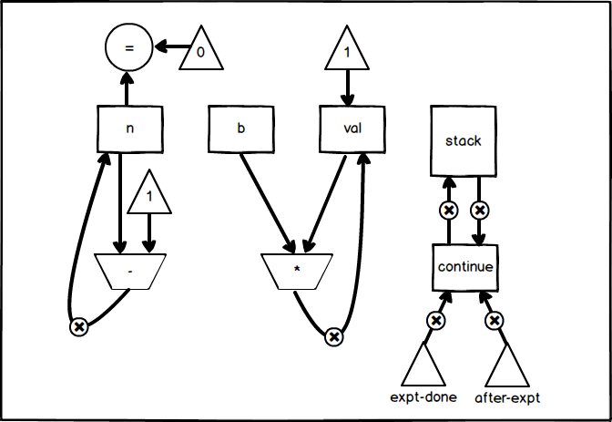
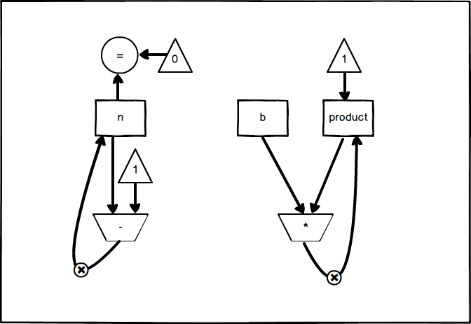

## exercise 5.4

### a)

``` Scheme
(controller
  (assign continue (label expt-done))
expt-loop
  (test (op =) (reg n) (const 0))
  (branch (label base-case))
  
  (save continue)
  (assign n (op -) (reg n) (const 1))
  (assign continue (label after-expt))
  (goto (label expt-loop))
  
after-expt
  (restore continue)
  (assign val (op *) (reg b) (reg val))
  (goto (reg continue))

base-case
  (assign val (const 1))
  (goto (reg continue))  
expt-done)
```

Input register b、n, output register val.The data path diagram is as follows:




### b)

``` Scheme
(controller
  (assign product (const 1))

expt-loop  
  (test (op =) (reg n) (const 0))
  (branch (label expt-done))
  
  (assign product (op *) (reg b) (reg product))
  (assign n (op -) (reg n) (const 1))
  (goto (label expt-loop))
expt-done)
```

Input register b、n, output register product.The data path diagram is as follows



Compare a) and b) data path diagrams.You can see that in the iteration implementation of b), the stack and continue register do not appear, and the rest of the components are the same as a).
