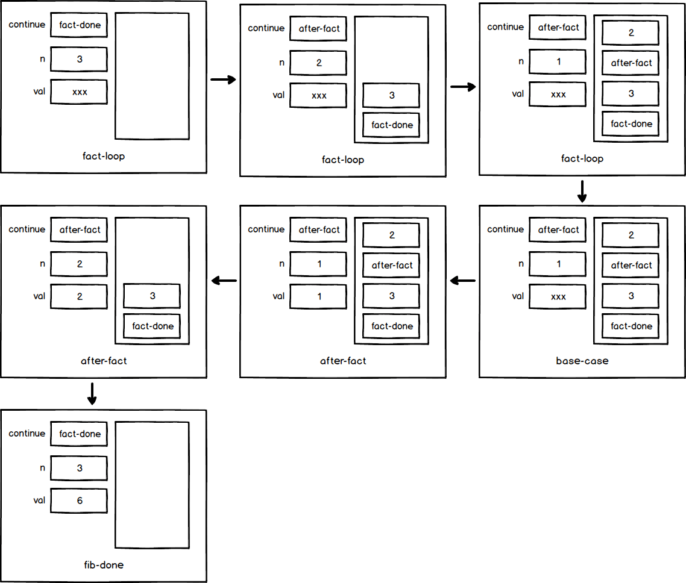
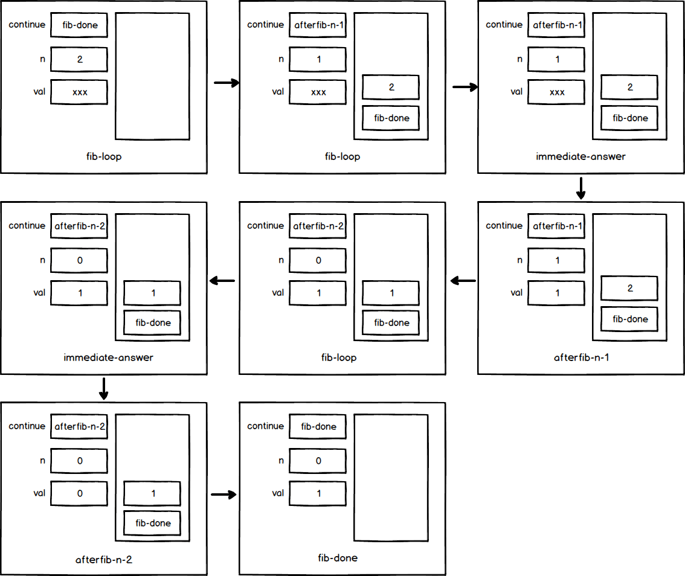

## exercise 5.5

### a)

The factorial calculation process, n = 3, in fact-loop, after-fact, base-case, fact-done, the value of each register and stack is shown as follows:

val = xxx, means that val has not been initialized.。

### b)

n the Fibonacci calculation process, n = 2 is taken. In fib-loop, afterfib-n-1, afterfib-n-2, immediate-answer, and fib-done, the values of each register and stack are shown as follows:

